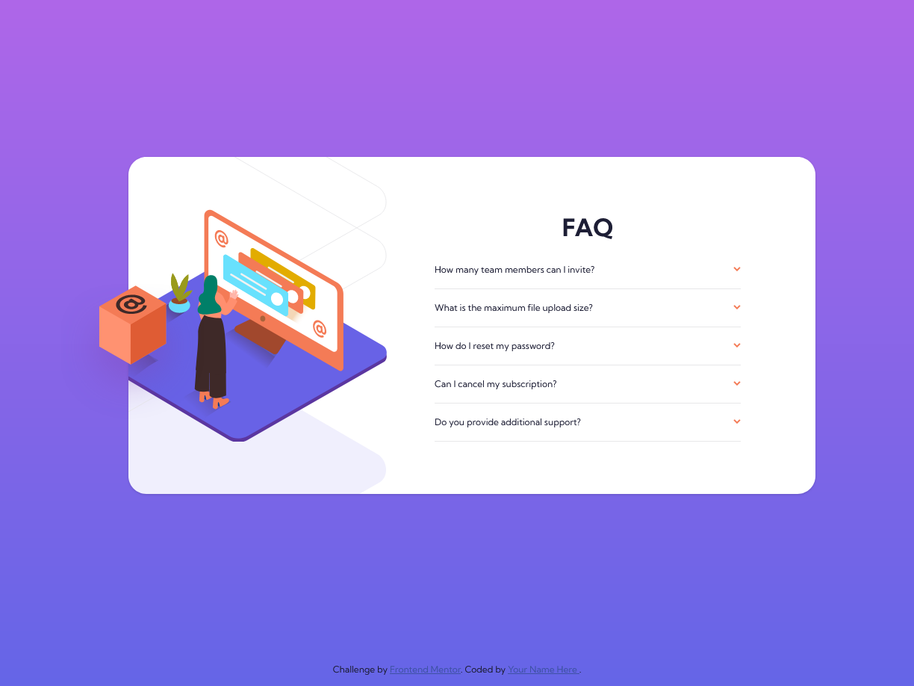

# Frontend Mentor - FAQ accordion card solution

This is a solution to the [FAQ accordion card challenge on Frontend Mentor](https://www.frontendmentor.io/challenges/faq-accordion-card-XlyjD0Oam). Frontend Mentor challenges help you improve your coding skills by building real projects.

## Table of contents

- [Overview](#overview)
  - [The challenge](#the-challenge)
  - [Screenshot](#screenshot)
  - [Links](#links)
- [My process](#my-process)
  - [Built with](#built-with)
  - [What I learned](#what-i-learned)
  - [Continued development](#continued-development)
  - [Useful resources](#useful-resources)
- [Author](#author)

## Overview

### The challenge

Users should be able to:

- View the optimal layout for the component depending on their device's screen size
- See hover states for all interactive elements on the page
- Hide/Show the answer to a question when the question is clicked

### Screenshot



### Links

- Solution URL: [GitHub](https://github.com/boonyarit-iamsaard/fm-faq-accordion-card)
- Live Site URL: [Live Preview](https://boonyarit-iamsaard.github.io/fm-faq-accordion-card/)

## My process

### Built with

- Semantic HTML5 markup
- CSS custom properties
- CSS Flexbox
- CSS Grid
- Mobile-first workflow
- Vanilla Javascript

### What I learned

If you want the coordinates of the absolute position child element to be applied to its parent element, you need to relatively position the parent element.

See the code snippet below:

```css
.parent {
  position: relative;
}

.child {
  position: absolute;
  top: 50%;
  left: 0;
}
```

[JSDoc](https://jsdoc.app/) helps document the JavaScript code and Visual Studio Code IntelliSense.

See the code snippet below:

```js
/**
 * Toggle the accordion
 * @param {Element} header - The accordion header element.
 * @param {Boolean} [expanded] - Expands the accordion, otherwise collapses it (default: false).
 */
const toggleAccordion = (header, expanded = false) => {
  const content = header.nextElementSibling;

  if (!content) return;

  if (expanded) {
    header.classList.add('open');
    content.style['max-height'] = content.scrollHeight + 'px';
    content.style['margin-top'] = '1rem';
  } else {
    header.classList.remove('open');
    content.style['max-height'] = null;
    content.style['margin-top'] = null;
  }
};
```

Self-hosted font.

See the code snippet below:

```css
@font-face {
  font-family: 'Kumbh Sans';
  src: url('../fonts/kumbh-sans/KumbhSans-Regular.ttf') format('truetype');
  font-display: swap;
}
```

### Continued development

- [ ] Try positioning, and overlapping images using the CSS Grid approach.

### Useful resources

- [[FreeCodeCamp] CSS Positioning – Position Absolute and Relative Example](https://www.freecodecamp.org/news/css-positioning-position-absolute-and-relative/) - This helped me learn how to position absolute and relative.
- [[MDN] background-position](https://developer.mozilla.org/en-US/docs/Web/CSS/background-position) - This reference positioning the background image.

## Author

- Website - [Boonyarit Iamsa-ard](https://github.com/boonyarit-iamsaard)
- Frontend Mentor - [@boonyarit-iamsaard](https://www.frontendmentor.io/profile/boonyarit-iamsaard)
